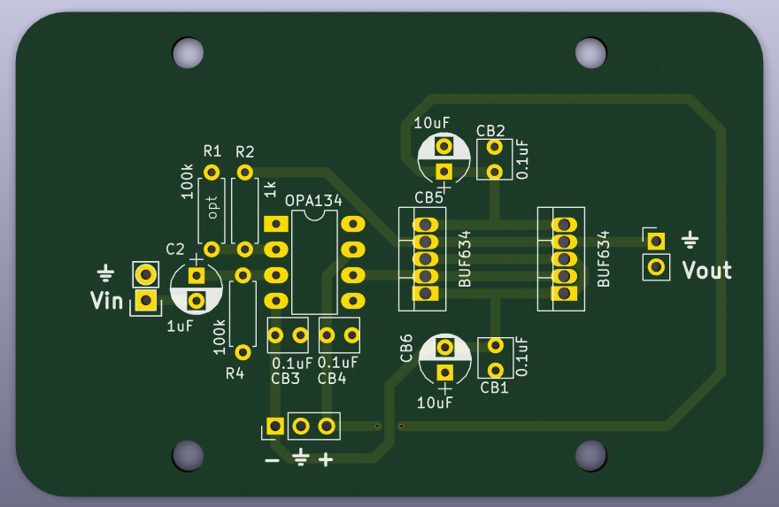

# Speaker drivers (2 watt)

## Overview

This circuit can drive a small earphone speaker that requires up to 2 watts of power (e.g., 500 mA current into an 8 ohm speaker). 

* It has unity gain in a non-inverting configuration (the speakers we work with only require about 1V maximum to achieve the desired sound levels).
* High-pass input stage with 1.26 Hz cutoff (basically a DC filter).
* Two BUF634 in parallel to provide up to 500 mA of current.

The board is 74mm x 48mm and the mounting holes, spaced 40mm x 40mm, are sized for a M3 screw. The board will fit in a Hammond enclosure that accomodates 75mm wide boards.

## Getting started

OSH Park will print and ship three of these boards for approximately $30. 

Order the parts from the [parts list](speaker%20drivers%20part%20list.md).

Solder all components. Be sure to attach heat sinks to the current buffers.

Wash the board with dH2O.

## Notes

Previous iterations of the design had a high-pass filter on the output.  However, we have modified the current iteration such that the high-pass filter is found on the input stage. This allows us to eliminate bulky components (required to handle the large current) that take up a lot of space.
